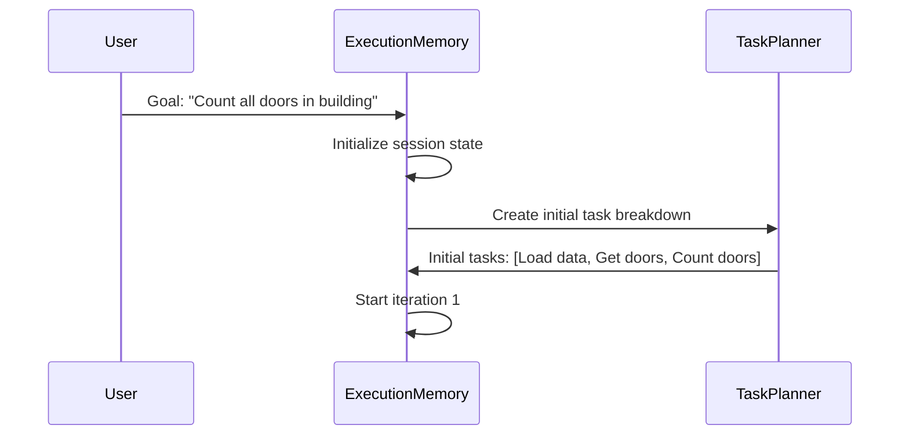
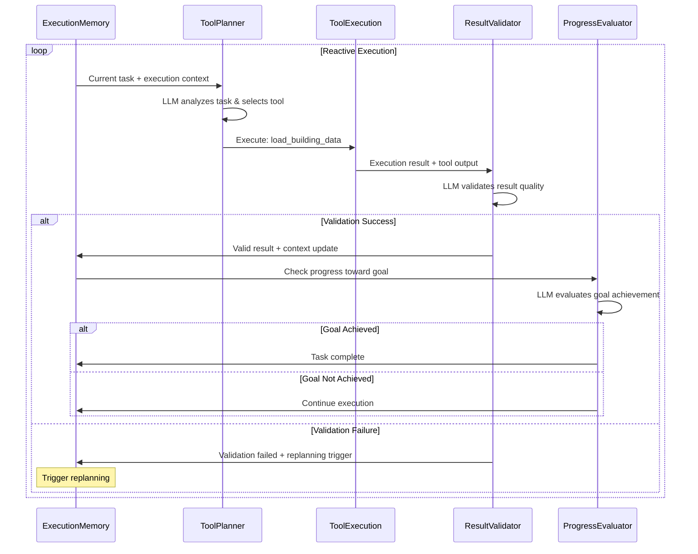
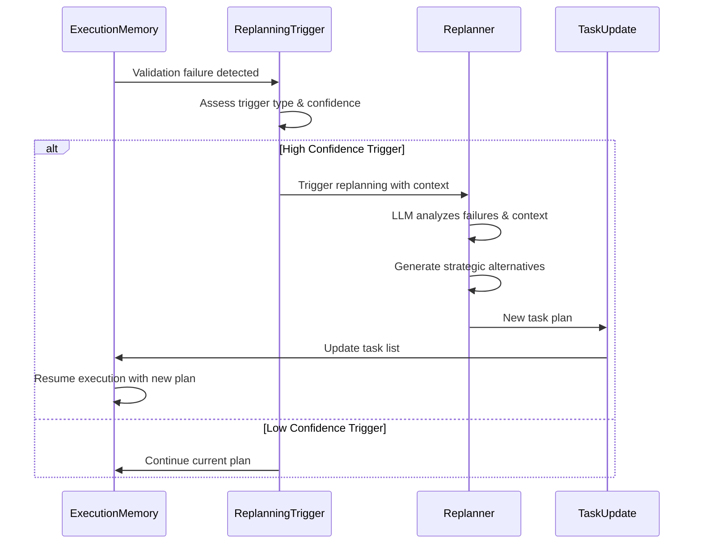
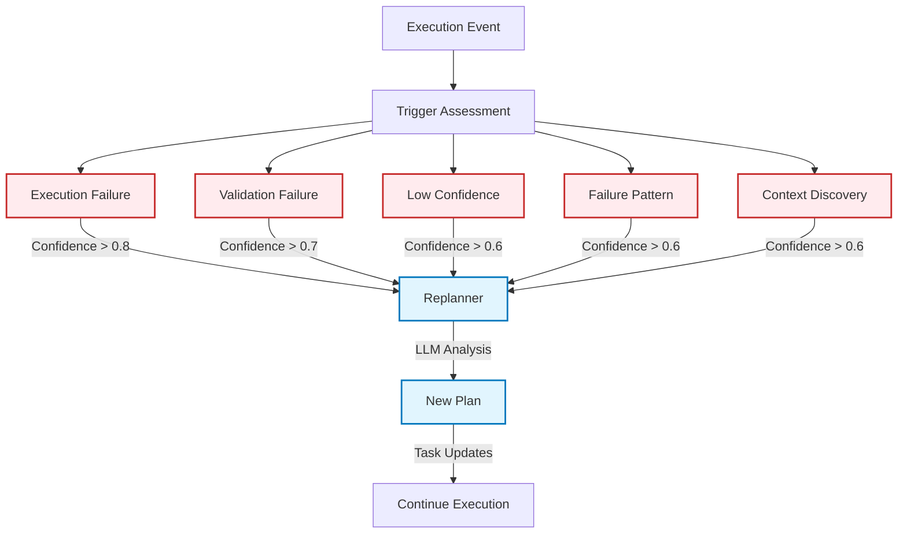
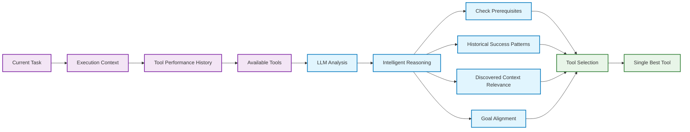
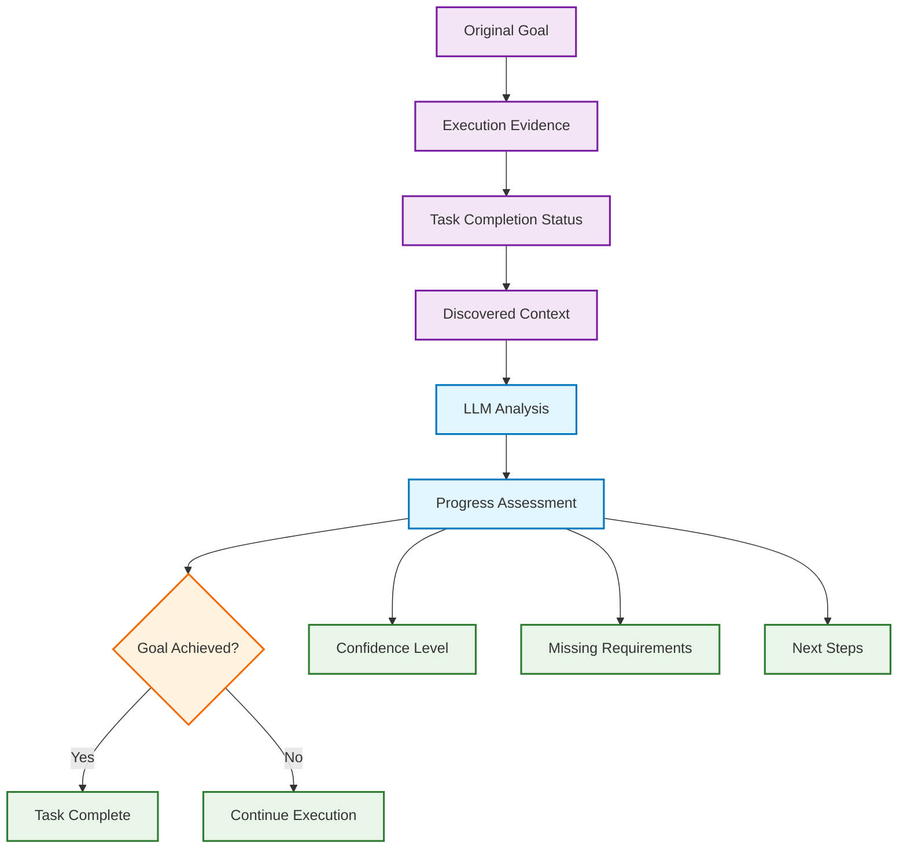
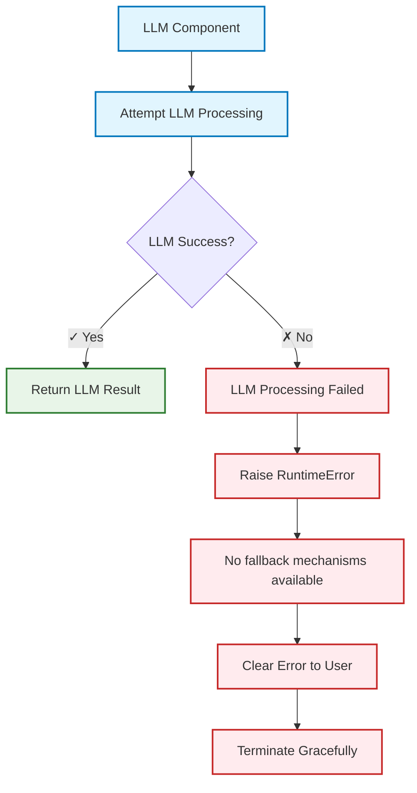

# Reactive Dynamic Planning Agent

## Overview

The Reactive Dynamic Planning Agent is a **100% LLM-based** intelligent system that adaptively plans and executes tasks to achieve user goals. The agent continuously learns from execution outcomes and dynamically adjusts its approach without any fallback mechanisms.

## Architecture Principles

- **Pure LLM Intelligence**: All decisions made by LLM reasoning, no rule-based fallbacks
- **Reactive Adaptation**: Continuously adapts based on execution outcomes
- **Dynamic Replanning**: Modifies task plans when current approach isn't working
- **Context Learning**: Leverages execution history for better decision making
- **Explicit Failures**: Clear error handling when LLM components fail

## Core Components

### 1. **ToolPlanner** (LLM-Only)
- **Purpose**: Select optimal tools for task execution
- **Intelligence**: Analyzes task requirements, execution history, and context
- **Input**: Task description, execution context, tool capabilities
- **Output**: Single best tool selection with reasoning
- **No Fallbacks**: Raises `RuntimeError` if LLM planning fails

### 2. **ResultValidator** (LLM-Only)  
- **Purpose**: Validate tool execution results and assess quality
- **Intelligence**: Evaluates output format, logical consistency, and progress
- **Input**: Task, execution result, tool output
- **Output**: Validation result with replanning trigger assessment
- **No Fallbacks**: Raises `RuntimeError` if LLM validation fails

### 3. **ProgressEvaluator** (LLM-Only)
- **Purpose**: Assess progress toward original goal achievement
- **Intelligence**: Analyzes evidence, context, and task completion status
- **Input**: Original goal, execution context, current tasks
- **Output**: Progress assessment with confidence and recommendations
- **No Fallbacks**: Raises `RuntimeError` if LLM evaluation fails

### 4. **Replanner** (LLM-Only)
- **Purpose**: Generate new task plans when current approach fails
- **Intelligence**: Analyzes failure patterns and creates strategic alternatives
- **Input**: Current goal, tasks, execution context, trigger details
- **Output**: New task plan with additions, modifications, and removals
- **No Fallbacks**: Raises `RuntimeError` if LLM replanning fails

### 5. **ExecutionMemory**
- **Purpose**: Track execution state, context, and learning insights
- **Storage**: Session state, execution steps, validation results, discovered context
- **Intelligence Support**: Provides rich context to all LLM components

## Main Reactive Loop

```mermaid
graph TD
    Start([User Goal Input]) --> Init[Initialize Session & Tasks]
    Init --> Loop{Start Reactive Loop}
    
    Loop --> TP[ToolPlanner<br/>LLM-Only]
    TP --> Exec[Execute Selected Tool]
    Exec --> Val[ResultValidator<br/>LLM-Only]
    
    Val --> VCheck{Validation<br/>Success?}
    VCheck -->|✓ Success| Mem[Update Execution Memory]
    VCheck -->|✗ Failure| RT[Replanning Trigger]
    
    Mem --> PE[ProgressEvaluator<br/>LLM-Only]
    PE --> PCheck{Goal<br/>Achieved?}
    
    PCheck -->|✓ Complete| End([Task Complete])
    PCheck -->|✗ Continue| IterCheck{Continue<br/>Execution?}
    
    IterCheck -->|✓ Yes| NextIter[Next Iteration]
    IterCheck -->|✗ No| MaxIter[Max Iterations Reached]
    MaxIter --> End
    
    RT --> RP[Replanner<br/>LLM-Only]
    RP --> UpdateTasks[Update Task Plan]
    UpdateTasks --> NextIter
    
    NextIter --> Loop
    
    %% Styling
    classDef llmComponent fill:#e1f5fe,stroke:#0277bd,stroke-width:3px
    classDef memoryComponent fill:#f3e5f5,stroke:#7b1fa2,stroke-width:2px
    classDef decision fill:#fff3e0,stroke:#ef6c00,stroke-width:2px
    classDef endpoint fill:#e8f5e8,stroke:#2e7d32,stroke-width:2px
    
    class TP,Val,PE,RP llmComponent
    class Mem memoryComponent  
    class VCheck,PCheck,IterCheck decision
    class Start,End endpoint
```

## Detailed Execution Flow

### Phase 1: Session Initialization



### Phase 2: Reactive Execution Loop



### Phase 3: Dynamic Replanning Loop



## Memory and Context Architecture

```mermaid
graph TD
    EM[ExecutionMemory] --> SS[Session State]
    EM --> ES[Execution Steps]
    EM --> VR[Validation Results]
    EM --> DC[Discovered Context]
    EM --> PM[Performance Metrics]
    
    SS --> Goal[Original Goal]
    SS --> Status[Current Status]
    SS --> Iter[Current Iteration]
    
    ES --> TaskExec[Task Executions]
    ES --> ToolPerf[Tool Performance]
    ES --> Results[Execution Results]
    
    VR --> ValSuccess[Success Patterns]
    VR --> ValFailures[Failure Patterns] 
    VR --> Confidence[Confidence Levels]
    
    DC --> BuildingData[Building Context]
    DC --> ElementInfo[Element Information]
    DC --> Insights[Execution Insights]
    
    PM --> SuccessRate[Success Rates]
    PM --> ToolStats[Tool Statistics]
    PM --> PlanMods[Plan Modifications]
    
    %% Context feeds into LLM components
    EM -.-> TP[ToolPlanner]
    EM -.-> RV[ResultValidator] 
    EM -.-> PE[ProgressEvaluator]
    EM -.-> RP[Replanner]
    
    classDef memory fill:#f3e5f5,stroke:#7b1fa2,stroke-width:2px
    classDef llm fill:#e1f5fe,stroke:#0277bd,stroke-width:2px
    
    class EM,SS,ES,VR,DC,PM memory
    class TP,RV,PE,RP llm
```



## LLM Intelligence Integration

### Context-Aware Decision Making

Each LLM component receives rich execution context:

```
Context Structure:
├── Execution Summary
│   ├── Total execution steps
│   ├── Success rate
│   ├── Unique tasks attempted/completed
│   └── Recent validation confidence
├── Recent Execution Steps (last 5)
│   ├── Task name and tool used
│   ├── Success/failure status
│   ├── Validation confidence
│   └── Discovered context
├── Discovered Context Summary
│   ├── Building data insights
│   ├── Element information
│   ├── Performance patterns
│   └── Strategic insights
├── Recent Failures (last 3)
│   ├── Failed task details
│   ├── Error messages
│   ├── Tool performance issues
│   └── Validation problems
└── Plan Modifications
    ├── Number of replanning events
    ├── Trigger types and frequency
    ├── Success of plan changes
    └── Adaptive learning patterns
```

## Replanning Triggers

The system triggers replanning based on intelligent assessment:



## Tool Planning Intelligence



## Progress Evaluation Intelligence



## Error Handling (No Fallbacks)



## Performance Characteristics

### Intelligence Quality
- **High Quality Decisions**: Every decision uses full LLM reasoning
- **Context Awareness**: All components leverage rich execution history
- **Adaptive Learning**: System improves through execution experience
- **Strategic Thinking**: Replanning considers long-term goal achievement

### Reliability
- **Explicit Failures**: Clear error messages when LLM unavailable
- **No Degraded Performance**: No fallback to suboptimal logic
- **Consistent Behavior**: Predictable failure modes
- **Recovery Capability**: Intelligent replanning from failures

### Scalability
- **Memory Efficiency**: Context summarization for large execution histories
- **Performance Tracking**: Detailed metrics for optimization
- **Tracing Integration**: Full LangSmith observability
- **Load Testing**: Validated performance under stress

## Usage Examples

### Basic Usage
```python
from aec_agent.reactive import ReactiveReasoningAgent

# Initialize with goal
agent = ReactiveReasoningAgent("Count all doors in building")

# Execute with reactive planning
result = agent.execute_with_reactive_planning(
    building_file="building.ifc",
    max_iterations=10
)

# Result contains goal achievement status and evidence
print(f"Goal achieved: {result.goal_achieved}")
print(f"Total doors found: {result.context['total_doors']}")
```

### Advanced Usage with Custom Components
```python
# Custom LLM for specialized reasoning
custom_llm = ChatOpenAI(model="gpt-4", temperature=0.1)

# Initialize components with custom LLM
progress_evaluator = ProgressEvaluator(llm=custom_llm)
validator = ResultValidator(llm=custom_llm)
replanner = Replanner(llm=custom_llm) 
tool_planner = ToolPlanner(llm=custom_llm)

# Use in reactive agent
agent = ReactiveReasoningAgent(
    goal="Complex compliance analysis",
    progress_evaluator=progress_evaluator,
    validator=validator,
    replanner=replanner,
    tool_planner=tool_planner
)
```

## Testing and Validation

### No-Fallback Testing
- **Pure LLM Testing**: All components tested with LLM-only operation
- **Failure Testing**: Verification of explicit `RuntimeError` when LLM fails
- **Integration Testing**: End-to-end reactive loops with no fallbacks
- **Performance Testing**: Stress testing under high load conditions

### Test Coverage
- **Unit Tests**: Individual component testing (65+ tests)
- **Integration Tests**: Component interaction testing (25+ tests)  
- **End-to-End Tests**: Complete reactive loop testing (10+ tests)
- **Performance Tests**: Load and stress testing (15+ tests)

## Future Enhancements

### Planned Features
1. **Multi-Model Support**: Different LLMs for different components
2. **Learning Persistence**: Long-term memory across sessions
3. **Goal Decomposition**: Automatic complex goal breakdown
4. **Parallel Execution**: Concurrent task execution where possible
5. **Advanced Observability**: Enhanced tracing and monitoring

### Research Directions
1. **Meta-Learning**: Agent learning how to learn from experience
2. **Cross-Domain Transfer**: Applying learned patterns across domains
3. **Collaborative Intelligence**: Multi-agent coordination
4. **Explainable Decisions**: Enhanced reasoning transparency

## Conclusion

The Reactive Dynamic Planning Agent represents a pure LLM-based approach to intelligent task execution. By eliminating all fallback mechanisms, the system ensures consistent high-quality decisions while maintaining clear failure modes. The reactive architecture enables continuous adaptation and learning, making the agent increasingly effective through experience.

Key benefits:
- **100% LLM Intelligence**: No degraded performance from rule-based fallbacks
- **Reactive Adaptation**: Continuous learning and plan adjustment
- **Clear Failures**: Explicit error handling without hidden fallbacks  
- **Rich Context**: Comprehensive memory supporting intelligent decisions
- **Strategic Planning**: Dynamic replanning based on execution insights

This architecture provides a foundation for building highly intelligent, adaptive AI agents that can tackle complex, multi-step tasks while maintaining transparency and reliability.